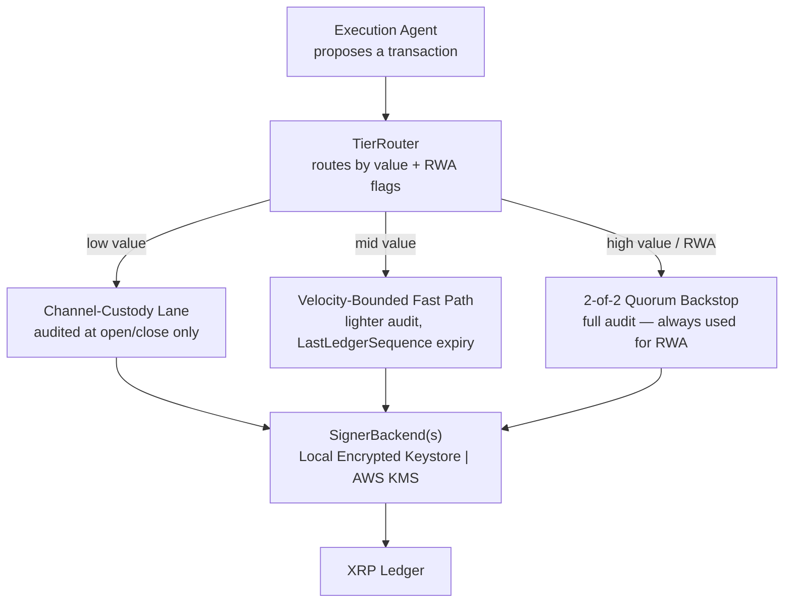

# QuorumVault

### Self-Custody 2-of-2 Multisig Risk Auditor & Circuit Breaker for AI Treasury Agents on the XRP Ledger

   

**A self-custody risk and control layer for AI execution agents operating on the XRP Ledger.**

Autonomous trading and treasury agents are increasingly authorized to move real capital — XRP, RLUSD, and other assets — without a human in the loop on every transaction. QuorumVault is the control layer that has to exist before that's safe: an independent Auditor Agent that reviews every proposed transaction against risk policy, and a 2-of-2 multisig custody model — enforced on-ledger by the XRPL itself — that makes it structurally impossible for a single compromised or malfunctioning agent to move funds unilaterally. No third party ever holds custody, including us.

> **Current status:** the 2-of-2 quorum, the signing abstraction, and the tiered routing described below are implemented and proven against XRPL Testnet with real transactions (hashes below), not simulated ones. Nothing here has touched Mainnet or real funds, and none of it has been through an independent security audit yet. See [Roadmap](#roadmap).

> **New here? Start with [`quorumvault/`](quorumvault/).** That's the real, tested (101 tests), Testnet-proven implementation — everything in this README describes it. This repo also keeps one historical, superseded prototype in [`legacy/`](legacy/) for its design-rationale docstring only; it has no ledger connection, no real cryptography, and does not reflect current functionality. See [Original design prototype](#original-design-prototype) if you're curious about its history, otherwise ignore it.

---

## Table of contents

- [Why QuorumVault](#why-quorumvault)
- [Real Testnet proof](#real-testnet-proof)
- [System architecture](#system-architecture)
- [Repository layout](#repository-layout)
- [The signing abstraction](#the-signing-abstraction)
- [v2 tiered assurance model](#v2-tiered-assurance-model)
- [Quickstart](#quickstart)
- [Security tradeoffs](#security-tradeoffs-flagged-not-hidden)
- [Roadmap](#roadmap)
- [Original design prototype](#original-design-prototype)
- [Safety notice](#safety-notice)
- [License](#license)

---

## Why QuorumVault

Most existing "safety" tools for AI agent payments — including well-established ones live on XRPL today — work by scoring a transaction's risk and forwarding it through a single point of custody if the score is low enough. That's a real and useful pattern, but it has a ceiling: it's a probabilistic judgment, not a structural guarantee. A sufficiently well-crafted attack, or a sufficiently confident-sounding hallucination, can still score as "low risk."

QuorumVault takes a different, complementary approach for a different situation: **infrequent, high-value corporate treasury transactions**, where the cost of a single bad outcome is severe enough to justify requiring two cryptographically independent parties to agree — not one risk model. No single compromised component, including the Auditor Agent itself, can move funds alone. And unlike custody-as-a-service models, the institution never hands wallet control to a third party at all.

This isn't a claim that QuorumVault is "better" than transaction-scoring infrastructure in general — high-frequency micropayments (paying per API call, machine-to-machine commerce) are a genuinely different problem with different constraints, and probabilistic scoring is the right tool there. QuorumVault is aimed squarely at the treasury custody problem instead.

---

## Real Testnet proof

Not a simulation — these are live, verifiable XRPL Testnet transactions:

| Step | Transaction | Hash |
|---|---|---|
| 1. Establish the 2-of-2 quorum | `SignerListSet` | `E22459B72B3F8E5D66BAAC47C00174703F6D15E4167F8AEACBE6B0E80CB4A88B` |
| 2. Disable the treasury master key | `AccountSet` (`asfDisableMasterKey`) | `2111BBA70A88950E0CE41DFF5D1681C9219BEA55288C90966BC0223DD7C1CC73` |
| 3. Multisigned payment | `Payment` — neither signer could move funds alone | `A71FEBAC99F8C8A04920731B844678207E94036A8A037A6F531405DBC55FC198` |

View the payment on the [XRPL Testnet Explorer](https://testnet.xrpl.org/transactions/A71FEBAC99F8C8A04920731B844678207E94036A8A037A6F531405DBC55FC198).

---

## System architecture

The core design principle: **the entity that decides whether a transaction is safe must never be the entity that can sign it alone.** Everything else in this project exists to make that separation real rather than just conceptual.



| Component | Responsibility | What it must NEVER do |
|---|---|---|
| **Execution Agent** | Generates transaction proposals | Never has direct access to a signing key or the custody layer |
| **Auditor Agent / risk engine** | Evaluates every proposal against policy (value threshold, whitelist, velocity, RWA compliance) | Never signs a transaction it hasn't itself evaluated |
| **TierRouter** | Picks the assurance lane by value; RWA-flagged transactions always escalate to the quorum backstop | Never let "lighter audit" relax the cryptographic quorum itself — only the policy scrutiny |
| **SignerBackend (keystore / KMS)** | Holds the actual signing key, produces `TxnSignature`s | Never expose plaintext key material to disk or logs |

---

## Repository layout

```
quorumvault/
├── signing/            the signing seam and its backends
│   ├── backend.py       SignerBackend — the interface everything else depends on
│   ├── keystore.py      AES-256-GCM + scrypt encrypted keystore, no plaintext at rest
│   ├── local_keystore.py  LocalEncryptedKeystoreBackend (ed25519 or secp256k1)
│   ├── kms_backend.py   AwsKmsSignerBackend (secp256k1) + AwsKmsEd25519SignerBackend (ed25519) — both non-exportable
│   └── quorum_signer.py QuorumSigner — combines backends into one multisigned tx
├── policy/             the risk rules
│   ├── risk_engine.py   value / whitelist / velocity rules + circuit breaker
│   ├── pricing.py       injectable RateProvider (no hardcoded exchange rate)
│   ├── rwa_rule.py      RWA compliance rule (MPTs, Credentials, Domains, Clawback)
│   ├── treasury_guard.py  live 2-of-2 config guard (no RegularKey, master disabled, SignerList matches)
│   └── agent_identity.py  XLS-70 credential check: is this signing agent legitimate / who vouches for it
├── tiers/              the v2 assurance lanes
│   ├── channel_custody.py  Payment-Channel lane (audited at open/close only)
│   ├── fast_path.py     Velocity-Bounded Fast Path (LastLedgerSequence expiry)
│   └── router.py        TierRouter — picks the lane by value
└── tools/
    └── migrate_keystore.py  import a plaintext checkpoint → encrypted keystore, then shred

tests/                          101 tests, fully offline, no network calls
testnet_multisig_demo.py        v1 — the original real Testnet proof (hashes above)
testnet_multisig_demo_v2.py     v2 — refactored onto the signing abstraction + tiers
legacy/
└── xrpl_auditor_production_blueprint.py   superseded logic-only prototype, kept for its
                                            architecture-spec docstring only (see below) —
                                            not part of the current implementation
requirements.txt
LICENSE
```

---

## The signing abstraction

Everything above signing depends on one interface:

```python
class SignerBackend(ABC):
    public_key: str          # XRPL hex pubkey (ED… or 02/03…)
    classic_address: str     # r…
    algorithm: str           # "ed25519" | "secp256k1"
    def sign(self, signing_blob: bytes) -> str: ...   # -> TxnSignature hex
```

`QuorumSigner([backend_a, backend_b]).multisign(tx)` produces a transaction that is **byte-for-byte identical** to xrpl-py's own `sign(multisign=True)` + `multisign()` — asserted directly in `tests/test_quorum_signer.py`. Swapping keystore ↔ HSM/KMS is invisible above this line. `tests/test_mixed_backend_quorum.py` proves a single quorum can freely mix backends and schemes — an ed25519 local-keystore signer, a secp256k1 KMS signer, and a non-exportable ed25519 KMS signer together — with no change to the quorum logic itself.

---

## v2 tiered assurance model

*"Safe at any speed, honest at any scale."* The proven 2-of-2 quorum stays as the high-value backstop; three lanes route each payment to the assurance level its stakes actually require:

| Lane | Audit point | Use case |
|---|---|---|
| **Channel-Custody** | Audited at open (2-of-2) and close; capacity policy-bounded | High-frequency, low-value payments via XRPL Payment Channels |
| **Velocity-Bounded Fast Path** | Lighter, auto-co-signed audit; on-ledger `LastLedgerSequence` expiry | Mid-value payments; over-ceiling or over-velocity escalates to the quorum |
| **2-of-2 Quorum Backstop** | Full audit, both signers | High-value transfers, and **always** RWA-flagged transactions regardless of size |

The RWA compliance rule is aware of MPTs, Credentials, Permissioned Domains, and Clawback — any RWA exposure escalates to the full quorum, no matter which lane a payment would otherwise route to.

---

## Quickstart

```bash
git clone https://github.com/QuorumVaultXRPL/quorumvault.git
cd quorumvault
pip install -r requirements.txt        # boto3 only needed for the AWS KMS backend

# Full offline test suite — 101 tests, no network calls
python -m pytest tests/ -q

# Offline dry run: tiered routing + a real 2-of-2 multisign, no broadcast
python testnet_multisig_demo_v2.py

# The original v1 proof against live XRPL Testnet (tx hashes above)
python testnet_multisig_demo.py
```

Live Testnet broadcast via the v2 demo is opt-in and double-gated:

```bash
export QUORUMVAULT_CONFIRM_TESTNET=yes
export QUORUMVAULT_TREASURY_ADDRESS=r...
python testnet_multisig_demo_v2.py --submit
```

---

## Configuration

Risk and routing parameters are no longer hardcoded at each call site — a non-technical operator can adjust them in a JSON file, with no code change and no redeploy. Copy `config.example.json`, edit the values, and point QuorumVault at it:

```python
from quorumvault.config import load_settings, default_settings

settings = load_settings("config.json")   # or default_settings() for the built-in defaults
risk_engine = settings.build_risk_engine()
router = settings.build_router()
```

`python testnet_multisig_demo_v2.py --config config.example.json` shows the same wiring; with no `--config` it falls back to `default_settings()` — the same `100` / `5000` ceilings and `5000` / `60s` / `3` risk defaults as before. This change is purely additive: every existing call site keeps working unchanged.

**Adjustable today** (see `config.example.json`): the destination `whitelist`, the `amount_threshold_rlusd` value gate, the velocity rule's `frequency_window_s` / `frequency_limit`, and the two tier ceilings `channel_ceiling_rlusd` / `fast_path_ceiling_rlusd`. Money fields are parsed with `json.load(parse_float=Decimal)`, so a value like `5000.10` stays an exact `Decimal` and never a binary-float artifact (a plain number is fine; a quoted `"5000.10"` string is accepted too). A bad file fails closed with a specific `ConfigError` — a missing or misspelled field, a wrong type, a non-positive number, or `channel_ceiling_rlusd >= fast_path_ceiling_rlusd` (the same invariant `TierRouter` enforces) — and never partially applies. An empty `whitelist` is valid and *maximally restrictive* (every destination flags RED), not a hole.

**Deliberately not adjustable via this file (yet):** security-critical trust anchors and infrastructure wiring are a different kind of setting than a business risk number, and don't belong in the same casually-edited file. So the treasury guard's expected signers/quorum (live signing authority — arguably deserves the same ceremony as an on-ledger `SignerListSet` change), agent-identity's recognized credential issuers / required credential type (security trust anchors), the refusal-alert webhook URL (infra/credential-adjacent), and KMS/signing-backend selection are all left for separate, deliberate treatment. There is no web UI here either — this is a file, not a dashboard.

---

## Security tradeoffs (flagged, not hidden)

1. **ed25519 and cloud HSM/KMS.** *(Corrected 2025-11-07.)* AWS KMS **now signs ed25519 natively** — key spec `ECC_NIST_EDWARDS25519`, signing algorithm `ED25519_SHA_512` with `MessageType="RAW"` — [announced Nov 7, 2025](https://aws.amazon.com/about-aws/whats-new/2025/11/aws-kms-edwards-curve-digital-signature-algorithm/) and available in all AWS Regions ([KMS key spec reference](https://docs.aws.amazon.com/kms/latest/developerguide/symm-asymm-choose-key-spec.html)). So today's ed25519 Testnet signers can move to a **non-exportable KMS-backed key with no curve migration and no `SignerListSet` change** — use `AwsKmsEd25519SignerBackend`, the ed25519 sibling of the original secp256k1 `AwsKmsSignerBackend`. That is a materially better production path than the earlier "migrate a signer to secp256k1 first, one at a time" route, which is no longer necessary; the secp256k1 KMS path still works unchanged if ever wanted. **GCP KMS** was not re-verified for this change — check Google Cloud KMS's current signing-algorithm list directly before assuming ed25519 support either way. HashiCorp Vault's `transit` engine remains an ed25519-capable alternative behind the same `SignerBackend` interface.
2. **The encrypted keystore is not an HSM.** It never writes plaintext key material to disk, but it must decrypt into process memory to sign, and Python cannot guarantee that memory is wiped. This is the floor for "near funds," not the ceiling — only a real HSM/KMS (key never leaves the boundary) closes that gap.
3. **Channel capacity is the audited exposure window.** The Channel-Custody lane is audited only at open and close; the capacity set at open is the bound on what could go wrong between them, and anything larger routes to the quorum instead.
4. **Value routing depends on a live rate.** Every tier boundary is denominated in RLUSD-equivalent value, so the exchange rate is an injected `RateProvider`, never a hardcoded constant — a stale price would otherwise silently misroute a transaction into a less-audited tier. `StaticRateProvider` is a clearly labelled Testnet placeholder (`is_live == False`); production requires a staleness-guarded `CallableRateProvider` wrapping a live feed. A real live implementation now exists at `integrations/price_feed.py` (`live_rate_provider()`, backed by a keyless Coinbase XRP→USD spot fetch that fails closed via a `StaleRateError` subclass on any fetch/parse error) — but it is **opt-in only**; `default_rate_provider()` itself is unchanged and remains the labelled Testnet placeholder.
5. **Governance transactions are refused *and* the live 2-of-2 is verified before signing.** `QuorumVaultExternalSigner` risk-gates only `Payment`s and refuses every other type — `SignerListSet`, `AccountSet`, `SetRegularKey`, etc. — by an allowlist (`DEFAULT_SIGNABLE_TX_TYPES`), so QuorumVault never *creates* a custody bypass through the payment path (`tests/test_external_signer_adversarial.py`). That refusal is now backed by an explicit runtime guard on the treasury's **live on-ledger state**, not just code-review discipline: an optional injected `TreasuryConfigVerifier` (`policy/treasury_guard.py`) that, before any signature is produced, reads the treasury's `account_info` and refuses unless (a) **no `RegularKey`** is set (an alternate single-key path around the quorum), (b) **`lsfDisableMaster`** (`0x00100000`) is set so the master key cannot sign unilaterally, and (c) the account's **live `SignerList` exactly matches the expected quorum** — same members, same `SignerQuorum`, and no single signer whose weight alone meets quorum. Any read failure or mismatch fails closed (`TreasuryConfigError`). It follows the `RateProvider` / `LedgerComplianceReader` seam pattern: `XrplTreasuryConfigVerifier` (live, `is_live == True`) over any `xrpl-py` client, and `StaticTreasuryConfigVerifier` (labelled placeholder, `is_live == False`) for offline tests/demos. Wiring a live guard is **required for any real (non-demo) treasury**; a signer with no guard wired still operates but emits a `TreasuryGuardNotWiredWarning` rather than silently assuming the account is safe. (Directly addresses the "signer list change / remove / bypass with regular key" scenarios raised in external technical review.)
6. **Agent identity is verified, not assumed — "is this agent legitimate / who controls it".** The risk engine bounds *what* an agent may spend and the treasury guard confirms *custody is intact*; neither answers whether the account holding the signing keys is a recognized party at all. An optional injected `AgentIdentityVerifier` (`policy/agent_identity.py`) closes that: before any signature, it reads each signing agent's XLS-70 Credentials (`account_objects`, `type=credential`) and refuses unless the agent is the **`Subject`** of a credential whose **issuer is in a caller-supplied recognized-issuer set**, whose **`CredentialType` matches exactly** (hex-encoded; XLS-70 defines no wildcard or hierarchy), which the subject has **accepted** (`lsfAccepted` `0x00010000` — issuance alone is explicitly "not yet valid"), and which has **not expired**. Any read failure, malformed response, or unmet condition fails closed (`AgentIdentityError`); an *empty* recognized-issuer set is treated as a configuration error, never as "trust anyone". By default it verifies every signer account in the quorum — one unaccredited agent invalidates a 2-of-2's legitimacy claim — and `identity_subjects` can point it elsewhere. Same seam pattern as the others: `XrplAgentIdentityVerifier` (live, `is_live == True`) over any `xrpl-py` client, `StaticAgentIdentityVerifier` (labelled placeholder, `is_live == False`) offline; no verifier wired emits an `AgentIdentityNotWiredWarning` rather than silently assuming legitimacy. **Scope boundary: QuorumVault consumes credentials, it never issues them** — deciding who counts as legitimate is an issuer's job, not the controller's. Known limitation, stated plainly: XLS-70 revocation is `CredentialDelete`, which *removes* the ledger entry, so a revoked credential and a never-issued one are the same observable on-ledger state and share one refusal reason.
7. **Refusals are observable, not just recorded (near-real-time alerting).** When `QuorumVaultExternalSigner` refuses a transaction the decision is recorded and the caller gets an `ExternalSignerRefused`, but nothing actively notifies a human — a silently-blocked bad transaction that nobody sees is only a partial win. An optional injected `RefusalAlertSink` (`integrations/alerts.py`) fires once on any refusal: `WebhookAlertSink` POSTs a JSON payload to a caller-supplied URL (works unmodified with Slack / Discord / any receiver), `NullAlertSink` is inert (`is_live == False`). It is **purely observational** — it does **not** change any refusal decision, it only makes an existing one visible. Alert delivery is fully isolated from the refusal: a down, slow, or erroring channel is caught and surfaced as an `AlertDeliveryFailedWarning`, never propagating as or suppressing the `ExternalSignerRefused`. Unlike the treasury / identity guards, a *missing* sink is deliberately **not** a fail-closed condition (the refusal already happened correctly), so there is no `*NotWiredWarning` for it.

---

## Roadmap

- [x] Real XRPL Testnet 2-of-2 quorum, treasury master key disabled, multisigned payment
- [x] Signing abstraction (`SignerBackend`) with interchangeable local-keystore and AWS KMS implementations
- [x] AES-256-GCM + scrypt encrypted keystore — no plaintext key material at rest or in logs
- [x] Tiered routing: Channel-Custody lane, Velocity-Bounded Fast Path, 2-of-2 quorum backstop
- [x] RWA compliance rule (MPTs, Credentials, Permissioned Domains, Clawback)
- [ ] Live AWS KMS run against a real non-exportable signer (ed25519 — no secp256k1 migration — or secp256k1; current KMS backends are tested against a mock)
- [x] RWA rule wired to live ledger reads, run against a real server, both live-tested paths: the MPT issuance/authorization path (2026-07-10, `mpt_rwa_demo.py` — a real MPT issuance, one compliant payment and one live-refused payment, both real tx) and the Credential/Permissioned-Domain path (2026-07-22, `credential_domain_rwa_demo.py` — a real issued+accepted XLS-70 Credential and a real Permissioned Domain, resolved live against a holder and a non-holder, cross-checked against independent raw ledger reads)
- [ ] SSO + hardware MFA (FIDO2/WebAuthn) for human overrides, replacing the current bare-token model
- [ ] Independent security audit — required before any of this touches Mainnet or real funds

---

## Original design prototype

`legacy/xrpl_auditor_production_blueprint.py` is the project's original logic-only prototype, moved out of the repo root into `legacy/` so it can't be mistaken for the current implementation. No XRPL dependency, no real cryptography (HMACs stand in for signatures) — it was written to prove out the risk-engine and human-override logic before any real ledger integration existed, and predates every Testnet proof above. It's kept only for its `SYSTEM_ARCHITECTURE_SPEC` docstring — the original network-separation and HSM/KMS production rationale, which the `quorumvault/` package now actually implements in real code.

```bash
python3 legacy/xrpl_auditor_production_blueprint.py   # the original 7-scenario risk-escalation demo — historical only
```

**This file is not representative of QuorumVault's current capabilities and has no ledger connection.** For anything real — the actual risk engine, signing, tiers, and RWA compliance — use `quorumvault/`, proven above against live XRPL Testnet.

---

## Safety notice

- **Testnet only.** Nothing in this repository has been deployed to XRPL Mainnet or connected to real funds.
- The `quorumvault/` signing and custody code is real — real keys, real ed25519/secp256k1 signatures, real on-ledger multisig — but it has **not yet been through an independent security audit**, which is a hard prerequisite before any real-funds use.
- `legacy/xrpl_auditor_production_blueprint.py` alone performs no real cryptography and has no ledger connection whatsoever — historical only (see above).

## License

This project is licensed under the [Business Source License 1.1](LICENSE). Free for non-commercial use, testing, evaluation, and educational purposes. Any commercial production deployment requires a separate commercial license — see the `LICENSE` file for full terms and contact information. Converts automatically to GNU GPLv3 on 2029-07-09.

---

## Author

**Jason Michael Jung** — [jasonjung0019@gmail.com](mailto:jasonjung0019@gmail.com)

© 2026 Jason Michael Jung. All rights reserved except as granted under the LICENSE.
