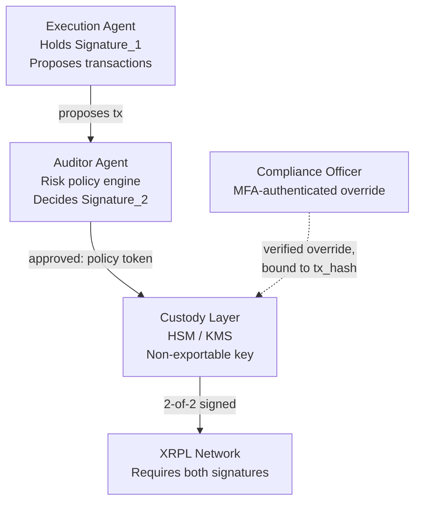

# QuorumVault

### An XRPL AI Risk Auditor & Circuit Breaker

  

**A self-custody risk and control layer for AI execution agents operating on the XRP Ledger.**

Autonomous trading and treasury agents are increasingly authorized to move real capital — XRP, RLUSD, and other assets — without a human in the loop on every transaction. QuorumVault is a reference architecture and working simulation for the control layer that has to exist *before* that's safe: an independent Auditor Agent that reviews every proposed transaction against corporate risk policy, and a 2-of-2 multi-signature custody model that makes it structurally impossible for a single compromised or malfunctioning agent to move funds unilaterally — without handing custody to any third party, including us.

> **This is a prototype and logic simulation, not production software.** It has no connection to real XRPL accounts, real cryptographic custody, or real funds. See [Production Roadmap](#production-roadmap) and the Safety Notice below before you take any of this further.

---

## Table of contents

- [Project overview](#quorumvault)
- [Why QuorumVault](#why-quorumvault)
- [System architecture](#system-architecture)
- [How to run the simulation](#how-to-run-the-simulation)
- [What to look for in the output](#what-to-look-for-in-the-output)
- [Production roadmap](#production-roadmap)
- [Safety notice](#safety-notice)
- [License](#license)

---

## Why QuorumVault

Most existing "safety" tools for AI agent payments — including well-established ones live on XRPL today — work by scoring a transaction's risk and then forwarding it through a single point of custody if the score is low enough. That's a real and useful pattern, but it has a ceiling: it's a probabilistic judgment, not a structural guarantee. A sufficiently well-crafted attack, or a sufficiently confident-sounding hallucination, can still score as "low risk."

QuorumVault takes a different, complementary approach for a different situation: **infrequent, high-value corporate treasury transactions**, where the cost of a single bad outcome is severe enough to justify requiring two cryptographically independent parties to agree — not one risk model. No single compromised component, including the Auditor Agent itself, can move funds alone. And unlike custody-as-a-service models, the institution never hands wallet control to a third party at all.

This isn't a claim that QuorumVault is "better" than transaction-scoring infrastructure in general — high-frequency micropayments (paying per API call, machine-to-machine commerce) are a genuinely different problem with different constraints, and probabilistic scoring is the right tool there. QuorumVault is aimed squarely at the treasury custody problem instead.

---

## System architecture

The core design principle: **the entity that decides whether a transaction is safe must never be the entity that can sign it alone.** Everything else in this project exists to make that separation real rather than just conceptual.



| Component | Responsibility | What it must NEVER do |
|---|---|---|
| **Execution Agent** | Generates transaction proposals, holds `Signature_1` | Never has network access to the Auditor's signing key or the custody layer |
| **Auditor Agent** | Evaluates every proposal against risk rules; decides whether `Signature_2` is produced | Never signs a transaction it hasn't itself evaluated; never lets the Execution Agent call it directly for a signature |
| **Custody layer (HSM/KMS)** | Physically holds the private key; performs the actual signing | Never exports the private key; never signs without a valid policy-approval token |
| **Compliance Officer** | Can authorize a flagged transaction, or reset a tripped circuit breaker | Their override is bound to a specific `tx_hash`, never to free text — it can't be reused for a different transaction |

### Risk policy: three rules, two severities

| Rule | Severity | Effect |
|---|---|---|
| Value threshold exceeded | `YELLOW` | `Signature_2` withheld for **that transaction**; requires a human override to broadcast |
| Untrusted / non-whitelisted destination | `RED` | `Signature_2` withheld **and** the circuit breaker freezes — every subsequent transaction is blocked until a human resets it |
| Anomalous transaction velocity (loop detection) | `RED` | Same as above — freezes the breaker |

**Compound risk accumulation**: if a transaction fires more than one rule at once (e.g. it's both over the value threshold *and* part of a detected loop), every fired reason is accumulated and reported — not just whichever one happened to be the hard trigger. This is what makes the plain-English `explain_my_position()` output trustworthy as an audit trail.

---

## How to run the simulation

The entire prototype is a single, dependency-free Python file — no `pip install`, no API keys, no network access required.

### Requirements

- Python 3.9 or later
- Standard library only (`hashlib`, `hmac`, `secrets`, `time`, `collections`, `enum`)

### Run it

```bash
git clone https://github.com/QuorumVaultXRPL/quorumvault.git
cd quorumvault
python3 xrpl_auditor_production_blueprint.py
```

That's it — the script runs a 7-scenario demo end to end and prints a full audit trail to your terminal in a few milliseconds.

---

## What to look for in the output

The demo walks through a realistic escalation sequence. Watch for these specific moments:

1. **Scenario 1** — a small, clean transaction is auto-approved with a full 2-of-2 multisig. No human involved.
2. **Scenarios 2–3** — a transaction over the value threshold gets `Signature_2` **withheld**. The broadcast is blocked (`MissingSignaturesError`), then succeeds only after a `HumanOverrideAuthority` token — cryptographically bound to that exact transaction's hash — is supplied.
3. **Scenario 4 — compound risk accumulation** — a third identical request in the same short window triggers *two* rules simultaneously (value threshold **and** loop detection). The output explicitly lists both accumulated reasons, and the circuit breaker trips.
4. **Scenario 5** — a completely unrelated, individually clean $10 transaction is still blocked, because the circuit breaker is now a persistent freeze, not a per-transaction filter. This is the difference between a "circuit breaker" and a simple threshold check.
5. **Scenarios 6–7** — a compliance officer resets the breaker with its own verified authorization, and normal automatic operation resumes.

If you want to explore beyond the demo, `run_demo()` at the bottom of the file is a good starting point to copy and modify — try changing `frequency_limit`, `amount_threshold_rlusd`, or feeding in your own transaction sequences via `MockTransactionPayload.from_dict()`.

---

## Production roadmap

This prototype proves the *logic*. None of the following exists yet, and all of it is required before this touches a real XRPL account:

- [ ] **HSM / KMS integration** — replace the in-memory HMAC "signing" with real custody: AWS CloudHSM/KMS, GCP Cloud HSM, Azure Managed HSM, or an MPC custody provider (Fireblocks, Copper). The private key must never exist in application memory.
- [ ] **XRPL Testnet wiring** — integrate [`xrpl-py`](https://github.com/XRPLF/xrpl-py) for real transaction serialization and submission. Configure the treasury account on-ledger via `SignerListSet` with the Execution Agent and Auditor as two signer entries and a quorum weight requiring both.
- [ ] **Real signature schemes** — move from toy HMAC strings to actual XRPL-supported `secp256k1` or `ed25519` signatures over the canonical transaction blob.
- [ ] **Service-level network separation** — split `ExecutionAgent` and `AuditorAgent` into two independently deployed services communicating over mTLS, so a compromised Execution Agent has no network path to the Auditor's signing capability.
- [ ] **SSO + hardware MFA for human overrides** — replace `HumanOverrideAuthority`'s bare HMAC key with a real identity provider integration (FIDO2/WebAuthn), and route overrides through an approval workflow product rather than a raw function call.
- [ ] **Tamper-evident audit logging** — write every signing decision and override to an append-only log independent of the application database (e.g. AWS CloudTrail for KMS operations, or a dedicated SIEM).
- [ ] **Independent security audit** — required before any real funds are placed under this system's custody. A misconfigured KMS key policy or an unreviewed override path is a realistic, high-severity failure mode.

Full architectural detail for each of these is in the `SYSTEM_ARCHITECTURE_SPEC` docstring at the bottom of `xrpl_auditor_production_blueprint.py`.

---

## Safety notice

- This code performs **no real cryptographic custody**. All "signatures" are HMACs over formatted strings, held in local Python process memory.
- This code has **no connection to the live XRP Ledger**, testnet or mainnet.
- This code has **not been security audited**.
- Do not connect this prototype to any wallet, exchange account, or system with access to real funds.

## License

This project is licensed under the [Business Source License 1.1](LICENSE). Free for non-commercial use, testing, evaluation, and educational purposes. Any commercial production deployment requires a separate commercial license — see the `LICENSE` file for full terms and contact information. Converts automatically to GNU GPLv3 on 2029-07-09.

---

## Author

**Jason Michael Jung** — [jasonjung0019@gmail.com](mailto:jasonjung0019@gmail.com)

© 2026 Jason Michael Jung. All rights reserved except as granted under the LICENSE.
